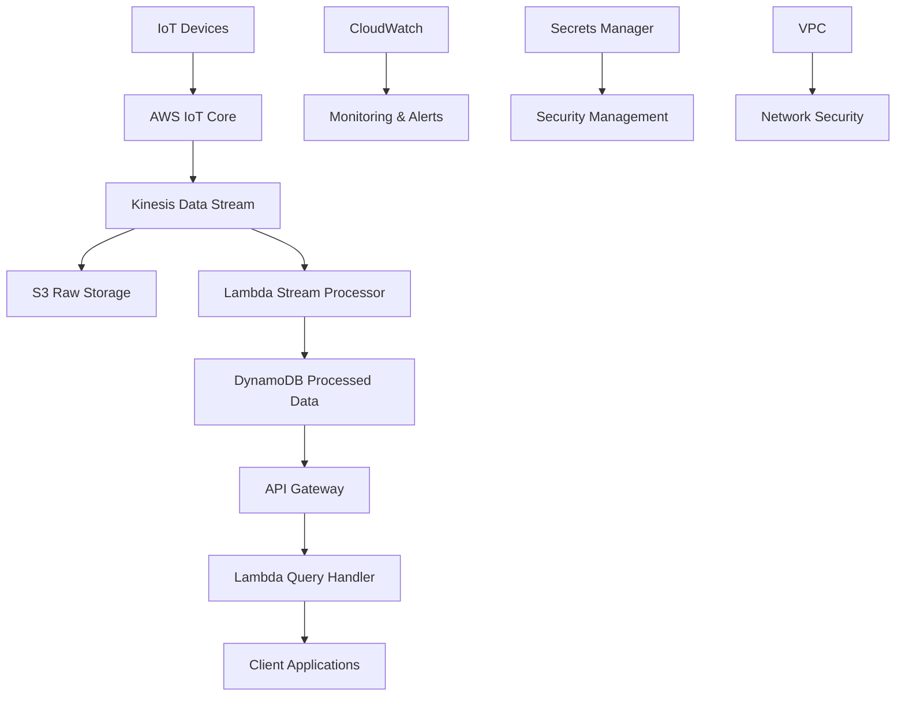

# Nền Tảng Phân Tích Dữ Liệu IoT - AWS Infrastructure

## 📋 Tổng Quan

Dự án này triển khai một nền tảng phân tích dữ liệu IoT có khả năng xử lý dữ liệu từ hàng triệu thiết bị cảm biến (nhiệt độ, độ ẩm) với kiến trúc serverless trên AWS.

## 🏗️ Kiến Trúc Hệ Thống



## 🎯 Tính Năng Chính

- **Ingest dữ liệu lớn**: Xử lý hàng triệu message/giây từ thiết bị IoT
- **Lưu trữ dữ liệu thô**: S3 với lifecycle policies cho chi phí tối ưu
- **Xử lý stream real-time**: Lambda functions xử lý dữ liệu theo thời gian thực
- **Query API**: RESTful API để truy vấn dữ liệu đã xử lý
- **Monitoring**: CloudWatch monitoring và alerting

## 🛠️ Công Nghệ Sử Dụng

| Thành phần | Công nghệ | Mục đích |
|------------|-----------|----------|
| **IoT Gateway** | AWS IoT Core | Nhận dữ liệu từ thiết bị IoT |
| **Stream Processing** | Kinesis Data Stream | Thu thập dữ liệu real-time |
| **Raw Storage** | Amazon S3 | Lưu trữ dữ liệu thô |
| **Data Processing** | AWS Lambda | Xử lý stream dữ liệu |
| **Processed Storage** | DynamoDB | Lưu trữ dữ liệu đã xử lý |
| **API Layer** | API Gateway + Lambda | Cung cấp REST API |
| **Monitoring** | CloudWatch | Giám sát và cảnh báo |
| **Security** | IAM, Secrets Manager | Bảo mật và quản lý quyền |

## 🔒 Bảo Mật

- **VPC với Public/Private Subnets**: Tách biệt môi trường
- **IAM Least Privilege**: Chỉ cấp quyền cần thiết
- **Secrets Manager**: Quản lý thông tin nhạy cảm
- **Encryption**: Mã hóa dữ liệu ở rest và in transit
- **Network Security**: Security Groups và NACLs

## 📊 Monitoring & Observability

- **CloudWatch Metrics**: Giám sát hiệu suất hệ thống
- **CloudWatch Logs**: Tập trung hóa logs
- **CloudWatch Alarms**: Cảnh báo khi có vấn đề
- **X-Ray**: Distributed tracing cho API calls

## 🚀 Triển Khai

### Yêu Cầu Hệ Thống

- Terraform >= 1.0
- AWS CLI configured
- Git

### Các Bước Triển Khai

1. **Clone repository**:
   ```bash
   git clone <repository-url>
   cd IOT_infra_aws
   ```

2. **Cấu hình AWS credentials**:
   ```bash
   aws configure
   ```

3. **Khởi tạo Terraform**:
   ```bash
   terraform init
   ```

4. **Plan và Apply**:
   ```bash
   terraform plan
   terraform apply
   ```

## 📁 Cấu Trúc Project

```
IOT_infra_aws/
├── README.md
├── main.tf
├── variables.tf
├── outputs.tf
├── versions.tf
├── modules/
│   ├── vpc/
│   ├── iot-core/
│   ├── kinesis/
│   ├── lambda/
│   ├── dynamodb/
│   ├── api-gateway/
│   └── monitoring/
├── environments/
│   ├── dev/
│   └── prod/
└── .github/
    └── workflows/
```

## 💰 Chi Phí Dự Kiến

| Dịch vụ | Chi phí ước tính/tháng |
|---------|----------------------|
| IoT Core | $50-200 |
| Kinesis | $100-500 |
| S3 | $20-100 |
| Lambda | $50-200 |
| DynamoDB | $100-300 |
| API Gateway | $50-150 |
| CloudWatch | $30-100 |
| **Tổng cộng** | **$400-1550** |

## 🔧 Maintenance

- **Backup**: Tự động backup dữ liệu
- **Updates**: Cập nhật security patches
- **Scaling**: Tự động scale theo tải
- **Monitoring**: 24/7 monitoring

## 📞 Support

Để hỗ trợ kỹ thuật, vui lòng tạo issue trong repository hoặc liên hệ team DevOps. 