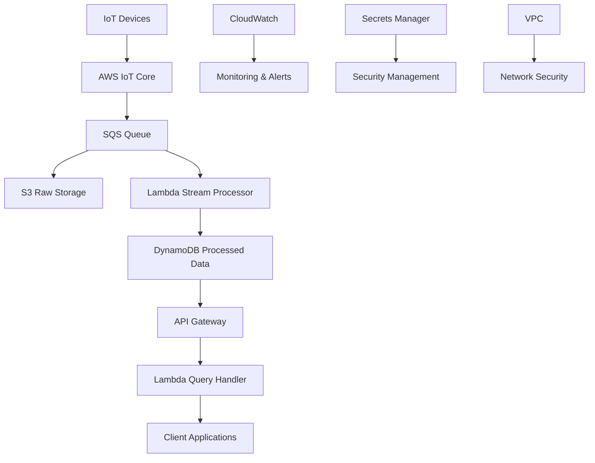

# Nền Tảng Phân Tích Dữ Liệu IoT - AWS Infrastructure

## 📋 Tổng Quan

Dự án này triển khai một nền tảng phân tích dữ liệu IoT có khả năng xử lý dữ liệu từ hàng triệu thiết bị cảm biến (nhiệt độ, độ ẩm) với kiến trúc serverless trên AWS.

## 🏗️ Kiến Trúc Hệ Thống



## 🎯 Tính Năng Chính

- **Ingest dữ liệu lớn**: Xử lý hàng triệu message/giây từ thiết bị IoT
- **Lưu trữ dữ liệu thô**: S3 với lifecycle policies cho chi phí tối ưu
- **Xử lý stream real-time**: Lambda functions xử lý dữ liệu theo thời gian thực
- **Query API**: RESTful API để truy vấn dữ liệu đã xử lý
- **Monitoring**: CloudWatch monitoring và alerting

## 🛠️ Công Nghệ Sử Dụng

| Thành phần | Công nghệ | Mục đích |
|------------|-----------|----------|
| **IoT Gateway** | AWS IoT Core | Nhận dữ liệu từ thiết bị IoT |
| **Stream Processing** | SQS Queue | Thu thập dữ liệu real-time |
| **Raw Storage** | Amazon S3 | Lưu trữ dữ liệu thô |
| **Data Processing** | AWS Lambda | Xử lý stream dữ liệu |
| **Processed Storage** | DynamoDB | Lưu trữ dữ liệu đã xử lý |
| **API Layer** | API Gateway + Lambda | Cung cấp REST API |
| **Monitoring** | CloudWatch | Giám sát và cảnh báo |
| **Security** | IAM, Secrets Manager | Bảo mật và quản lý quyền |

## 🔒 Bảo Mật

- **VPC với Public/Private Subnets**: Tách biệt môi trường
- **IAM Least Privilege**: Chỉ cấp quyền cần thiết
- **Secrets Manager**: Quản lý thông tin nhạy cảm
- **Encryption**: Mã hóa dữ liệu ở rest và in transit
- **Network Security**: Security Groups và NACLs

## 📊 Monitoring & Observability

- **CloudWatch Metrics**: Giám sát hiệu suất hệ thống
- **CloudWatch Logs**: Tập trung hóa logs
- **CloudWatch Alarms**: Cảnh báo khi có vấn đề
- **X-Ray**: Distributed tracing cho API calls

## 🚀 Triển Khai

### Yêu Cầu Hệ Thống

- Terraform >= 1.0
- AWS CLI configured
- Git

### Cấu Hình AWS Region

Dự án được cấu hình để chạy trên **AWS Region us-east-1 (Virginia)** để tối ưu chi phí và hiệu suất.

### Các Bước Triển Khai

1. **Clone repository**:
   ```bash
   git clone <repository-url>
   cd IOT_infra_aws
   ```

2. **Cấu hình AWS credentials**:
   ```bash
   aws configure
   ```

3. **Khởi tạo Terraform**:
   ```bash
   terraform init
   ```

4. **Plan và Apply**:
   ```bash
   terraform plan
   terraform apply
   ```

## 📁 Cấu Trúc Project

```
IOT_infra_aws/
├── README.md                           # Tài liệu chính
├── main.tf                            # Terraform configuration chính
├── variables.tf                       # Biến cấu hình
├── outputs.tf                         # Outputs sau triển khai
├── versions.tf                        # Provider versions
├── terraform.tfvars.example           # Template cấu hình
├── start.sh                          # Script khởi động nhanh
│
├── modules/                          # Terraform modules
│   ├── vpc/                          # 🌐 Network Infrastructure
│   │   ├── main.tf                   #   VPC, Subnets, NAT, IGW
│   │   ├── variables.tf              #   Network Security Groups
│   │   └── outputs.tf                #
│   ├── iot-core/                     # 📡 IoT Device Gateway
│   │   ├── main.tf                   #   IoT Policies, Topic Rules
│   │   ├── variables.tf              #   Thing Types, IAM Roles
│   │   └── outputs.tf                #
│   ├── sqs/                          # 📨 Message Queue
│   │   ├── main.tf                   #   SQS Queue + DLQ
│   │   ├── variables.tf              #   Message Processing
│   │   └── outputs.tf                #
│   ├── s3/                           # 🗄️ Raw Data Storage
│   │   ├── main.tf                   #   S3 Bucket, Lifecycle
│   │   ├── variables.tf              #   Encryption, Versioning
│   │   └── outputs.tf                #
│   ├── lambda/                       # ⚡ Serverless Processing
│   │   ├── main.tf                   #   Function Deployment
│   │   ├── variables.tf              #   IAM Policies, VPC Config
│   │   ├── outputs.tf                #
│   │   ├── build.sh                  #   Build script
│   │   ├── deploy-lambda.sh          #   Deploy script
│   │   ├── Makefile                  #   Build automation
│   │   └── lambda/                   #   Function source code
│   │       ├── stream_processor.py   #     📊 Data processing
│   │       └── query_handler.py      #     🔍 API query handler
│   ├── dynamodb/                     # 🗃️ Processed Data Store
│   │   ├── main.tf                   #   NoSQL Tables, Indexes
│   │   ├── variables.tf              #   TTL, Backup Config
│   │   └── outputs.tf                #
│   ├── api-gateway/                  # 🌍 REST API Gateway
│   │   ├── main.tf                   #   HTTP API, Routes
│   │   ├── variables.tf              #   CORS, Throttling
│   │   └── outputs.tf                #
│   └── monitoring/                   # 📊 Observability
│       ├── main.tf                   #   CloudWatch Alarms
│       ├── variables.tf              #   SNS Notifications
│       └── outputs.tf                #   Metrics & Logs
│
├── environments/                     # 🌍 Environment Configs
│   ├── dev/                          #   Development
│   │   └── main.tf                   #   Dev-specific settings
│   └── prod/                         #   Production
│       └── main.tf                   #   Prod-specific settings
│
├── scripts/                          # 🔧 Automation Scripts
│   └── deploy.sh                     #   Deployment automation
│
├── tests/                            # 🧪 Testing & Validation
│   ├── README_TEST_SCRIPTS.md        #   Test documentation
│   ├── TEST_GUIDE.md                 #   Testing guide
│   ├── test_iot_system.sh           #   System tests
│   ├── generate_sample_data.sh       #   Sample data generator
│   ├── get_terraform_info.sh         #   Infrastructure info
│   └── sample_data_*.json            #   Test data files
│
├── docs/                             # 📚 Documentation
│   ├── DEPLOYMENT.md                 #   Deployment guide
│   ├── TROUBLESHOOTING.md            #   Troubleshooting
│   ├── FREE_TIER_OPTIMIZATION.md    #   Cost optimization
│   ├── flow_step.md                  #   System flow
│   ├── đề-bài.md                    #   Requirements
│   ├── yêu-cầu-chung.md             #   General requirements
│   └── chi-phí-free-tier.md         #   Cost analysis
│
├── images/                           # 📸 Result Screenshots
│   ├── Screen Shot 2025-08-03 at 18.05.53.png
│   ├── Screen Shot 2025-08-03 at 18.06.31.png
│   ├── Screen Shot 2025-08-03 at 18.06.39.png
│   └── Screen Shot 2025-08-03 at 18.06.50.png
│
├── ARCHITECTURE_CHANGES.md           # 🏗️ Architecture updates
└── DEPLOYMENT_GUIDE.md               # 🚀 Deployment instructions
```

### 🔗 Luồng Dữ Liệu
```
[IoT Devices] → [IoT Core] → [SQS] → [Lambda] → [DynamoDB]
                                  ↓
                              [S3 Raw Data]
                                  
[Client] → [API Gateway] → [Lambda] → [DynamoDB] → [Response]
```

## 📸 Kết Quả Triển Khai

Dưới đây là các hình ảnh minh họa kết quả sau khi triển khai thành công hệ thống IoT trên AWS:


### 🎯 Tính Năng Đã Triển Khai

✅ **IoT Data Ingestion**: Nhận dữ liệu từ thiết bị IoT qua MQTT  
✅ **Real-time Processing**: Xử lý stream data với Lambda  
✅ **Data Storage**: Lưu trữ raw data (S3) và processed data (DynamoDB)  
✅ **REST API**: Query API thông qua API Gateway  
✅ **Monitoring**: CloudWatch alarms và notifications  
✅ **Security**: VPC, IAM roles và encryption  
✅ **Cost Optimization**: Free Tier configuration  

